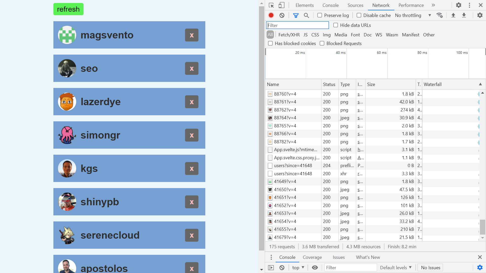

# :zap: Svelte RXJS API

* Snowpack-generated Sveltejs app to display random Github users
* Code by [Ilia Mikhailov of Codechips.me](https://codechips.me/) - see [:clap: Inspiration](#clap-inspiration) below. Some minor changes due to deprecations & commenting.
* **Note:** to open web links in a new window use: _ctrl+click on link_

## :page_facing_up: Table of contents

* [:zap: Svelte RXJS API](#zap-svelte-rxjs-api)
  * [:page_facing_up: Table of contents](#page_facing_up-table-of-contents)
  * [:books: General info](#books-general-info)
  * [:camera: Screenshots](#camera-screenshots)
  * [:signal_strength: Technologies](#signal_strength-technologies)
  * [:floppy_disk: Setup](#floppy_disk-setup)
  * [:wrench: Testing](#wrench-testing)
  * [:computer: Code Examples](#computer-code-examples)
  * [:cool: Features](#cool-features)
  * [:clipboard: Status & To-Do List](#clipboard-status--to-do-list)
  * [:clap: Inspiration - code by Ilia Mikhailov](#clap-inspiration---code-by-ilia-mikhailov)
  * [:file_folder: License](#file_folder-license)
  * [:envelope: Contact](#envelope-contact)

## :books: General info

* App bootstrapped with [Create Snowpack App (CSA)](https://www.snowpack.dev/)
* Displays random Github user details
* Note: Rxjs 'combineLatest' is deprecated - replaced with combineLatestWith
* `JSON.stringify()` method initially used to convert a JavaScript object to a JSON string

## :camera: Screenshots

## :signal_strength: Technologies

* [Snowpack v3](https://www.snowpack.dev/) frontend build tool, alternative to webpack or Parcel etc.
* [Sveltejs v3](https://svelte.dev/) fast front-end UI library with small bundles of highly-optimized vanilla JavaScript & declarative transitions. Does not use a virtual DOM.
* [RxJS v7](https://rxjs.dev/) Reactive Extensions JS library
* [RxJS/AJAX] used to fetch Github API observable
* [Github REST API v2](https://docs.github.com/en/rest/reference/users) RESTful API with data on all world countries. [Get a Github access token](https://github.com/settings/tokens) so API access not limited

## :floppy_disk: Setup

* `npm i` to install dependencies
* `npm start` to run Snowpack dev server on port `localhost:8080`
* `npm run build` to build a static copy of app to a `build/` folder

## :wrench: Testing

* N/A

## :computer: Code Examples

* N/A

## :cool: Features

* N/A

## :clipboard: Status & To-Do List

* Status: Working
* To-Do: Add more commenting and try diffferent RxJS methods

## :clap: Inspiration - code by Ilia Mikhailov

* [Ilia Mikhailov: Recreating a classic FRP tutorial with Svelte and RxJS](https://codechips.me/classic-frp-tutorial-with-svelte-rxjs-6/)

## :file_folder: License

* N/A

## :envelope: Contact

* Repo created by [ABateman](https://github.com/AndrewJBateman), email: gomezbateman@yahoo.com
